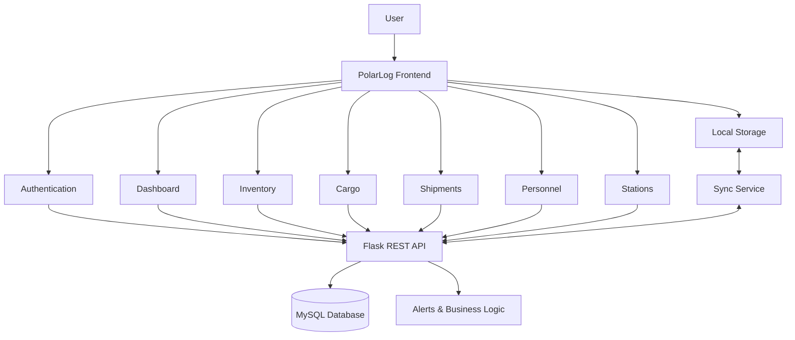

# ❄️ POLARLOG

<p align="center">
  <strong>Integrated Polar Expedition Logistics & Asset Management System</strong>
</p>

<p align="center">
  A unified digital platform for managing <b>cargo, inventory, personnel, shipments and station operations</b> across Indian polar expeditions.
</p>

<p align="center">


</p>

---

## 🌐 Overview

**PolarLog** is a web-based logistics and asset management platform designed for the unique operational requirements of **Indian polar expeditions**.

The platform brings essential expedition workflows into a single system, allowing teams to monitor:

> 📦 **Cargo**
> 🚢 **Shipments**
> 📊 **Station Inventory**
> 👥 **Personnel**
> 🏔️ **Stations**
> 🚨 **Operational Alerts**
> 📈 **Mission Progress**

Instead of relying on disconnected spreadsheets and manual records, PolarLog aims to provide a **single operational view of the expedition ecosystem**.

---

## 🎯 The Problem

Polar expeditions operate in environments where:

* Resupply can be difficult and time-sensitive
* Connectivity may be unreliable
* Multiple teams need access to shared logistics information
* Critical resources must be monitored continuously
* Manual tracking can create delays and information gaps

A logistics coordinator should not have to search through multiple spreadsheets to answer:

> **“What is running low, where is it located, and when is the next shipment arriving?”**

### PolarLog brings that information together.

---

# 💡 Our Approach

```text
                  ┌─────────────────────────┐
                  │       POLARLOG          │
                  │   Unified Operations    │
                  │        Platform        │
                  └────────────┬────────────┘
                               │
          ┌────────────────────┼────────────────────┐
          │                    │                    │
          ▼                    ▼                    ▼
      INVENTORY             CARGO              PERSONNEL
          │                    │                    │
          └────────────────────┼────────────────────┘
                               │
                               ▼
                         SHIPMENTS
                               │
                               ▼
                          STATIONS
                               │
                               ▼
                        ALERTS & INSIGHTS
```

PolarLog connects the pieces instead of treating them as isolated systems.

---

# ✨ Key Capabilities

<table>
<tr>
<td width="50%">

### 📊 Unified Dashboard

A centralized operational overview showing:

* Station status
* Inventory levels
* Shipment activity
* Critical alerts
* Mission progress
* Operational metrics

</td>

<td width="50%">

### 📦 Cargo Management

Digitally manage expedition cargo including:

* Cargo details
* Categories
* Quantity & weight
* Origin & destination
* Priority
* Delivery status

</td>
</tr>

<tr>
<td>

### 🚢 Shipment Tracking

Track logistics movements through:

```text
PENDING
   ↓
IN TRANSIT
   ↓
DELIVERED
```

Providing clear visibility into the movement of supplies.

</td>

<td>

### 📦 Inventory Management

Monitor station resources and identify critical shortages across:

* Food
* Fuel
* Medical supplies
* Equipment
* Essential resources

</td>
</tr>

<tr>
<td>

### 👥 Personnel Management

Maintain expedition personnel records with relevant station and assignment information.

</td>

<td>

### 🚨 Operational Alerts

Highlight important situations such as:

* Low stock
* Critical inventory
* Shipment delays
* Resupply requirements

</td>
</tr>
</table>

---

# 🏔️ Designed for Polar Operations

PolarLog is not intended to be a generic inventory management application.

It is designed around the operational context of **Indian polar stations**.

### Supported station model

```text
                 INDIAN POLAR EXPEDITIONS

                         │
          ┌──────────────┼──────────────┐
          │              │              │
          ▼              ▼              ▼
      BHARATI          MAITRI         HIMADRI
          │              │              │
          └──────────────┼──────────────┘
                         │
                         ▼
                   POLARLOG CORE
```

The interface can provide station-specific visibility into:

**Inventory → Personnel → Cargo → Shipments → Alerts**

---

# 📡 Offline-First Design

Remote polar environments introduce a major challenge:

> **Connectivity cannot always be assumed.**

PolarLog therefore considers an **offline-first workflow** as part of the system architecture.

### Intended workflow

```text
             ┌───────────────┐
             │    ONLINE     │
             └───────┬───────┘
                     │
                     ▼
                Fetch / Sync
                     │
                     ▼
              Local Application
                     │
             CONNECTION LOST
                     │
                     ▼
             ┌───────────────┐
             │  OFFLINE MODE │
             └───────┬───────┘
                     │
                     ▼
              Local Data Store
                     │
             CONNECTION RESTORED
                     │
                     ▼
             Synchronization
                     │
                     ▼
               ✓ DATA SYNCED
```

The objective is to keep essential workflows usable even when connectivity is temporarily unavailable.

---

# 🔗 Connected Logistics

One of the core ideas behind PolarLog is that operational events should be connected.

For example:

```text
LOW INVENTORY
      ↓
RESUPPLY REQUIRED
      ↓
CARGO CREATED
      ↓
SHIPMENT CREATED
      ↓
SHIPMENT IN TRANSIT
      ↓
SHIPMENT DELIVERED
      ↓
INVENTORY UPDATED
      ↓
ALERT RESOLVED
```

This creates a complete logistics workflow instead of a collection of disconnected CRUD screens.

---

# 🧠 Example Operational Scenario

### Scenario: Fuel shortage at Himadri

```text
1. Dashboard detects low fuel stock
                ↓
2. 🔴 Critical alert generated
                ↓
3. Logistics coordinator reviews inventory
                ↓
4. Resupply requirement created
                ↓
5. Cargo record generated
                ↓
6. Shipment initiated
                ↓
7. Shipment status → IN TRANSIT
                ↓
8. Shipment reaches Himadri
                ↓
9. Inventory automatically updated
                ↓
10. Alert status → RESOLVED
```

### The goal:

**Detect → Decide → Dispatch → Track → Deliver → Update**

---

# 🖥️ Application Modules

```text
POLARLOG
│
├── 🔐 Authentication
│   └── Role-based Access
│
├── 📊 Dashboard
│   ├── Mission Overview
│   ├── Station Status
│   ├── Inventory Overview
│   └── Alerts
│
├── 📦 Cargo Management
│
├── 🚢 Shipment Tracking
│
├── 📋 Inventory Management
│
├── 👥 Personnel Management
│
├── 🏔️ Station Management
│
└── 🚨 Notifications & Alerts
```

---

# 🏗️ System Architecture


```mermaid
flowchart TD

    A[User] --> B[PolarLog Frontend]

    B --> C[Authentication]
    B --> D[Dashboard]
    B --> E[Inventory]
    B --> F[Cargo]
    B --> G[Shipments]
    B --> H[Personnel]
    B --> I[Stations]

    C --> J[Flask REST API]
    D --> J
    E --> J
    F --> J
    G --> J
    H --> J
    I --> J

    J --> K[(MySQL Database)]

    J --> L[Alerts & Business Logic]

    B --> M[Local Storage]
    M <--> N[Sync Service]
    N <--> J
```

---

# 🛠️ Technology Stack

### Frontend

| Technology      | Purpose                          |
| --------------- | -------------------------------- |
| **HTML5**       | Application structure            |
| **CSS3**        | Styling & layout                 |
| **JavaScript**  | Application logic & interactions |
| **Bootstrap 5** | Responsive UI components         |
| **Chart.js**    | Data visualization               |

### Backend

| Technology          | Purpose                |
| ------------------- | ---------------------- |
| **Python**          | Backend development    |
| **Flask**           | REST API               |
| **MySQL Connector** | Database communication |

### Database

**MySQL 8**

Used for storing application data such as cargo, inventory, personnel, shipments and station information.

### Development Tools

```text
Git
GitHub
Postman
VS Code
```

---

# 🎨 User Interface Philosophy

PolarLog follows a **mission-control inspired interface** designed to prioritize:

### Visibility

Critical information should be visible immediately.

### Clarity

Users should understand the state of an operation without digging through multiple screens.

### Actionability

Alerts should lead directly to the action required.

### Reliability

The system should account for environments where connectivity may be unreliable.

---

# 📸 Interface Preview

> Screenshots will be added as development progresses.

### Landing Page

```text
┌─────────────────────────────────────────────┐
│                   POLARLOG                  │
│                                             │
│       Integrated Polar Logistics            │
│       & Asset Management Platform           │
│                                             │
│              [ ENTER POLARLOG ]             │
│                                             │
│           🏔 Bharati  🏔 Maitri             │
│                    🏔 Himadri               │
└─────────────────────────────────────────────┘
```

### Dashboard

```text
┌─────────────────────────────────────────────┐
│ POLARLOG                        🟢 ONLINE   │
├─────────────────────────────────────────────┤
│                                             │
│  03          127          18          84%   │
│ Stations    Cargo       Alerts      Stock  │
│                                             │
├─────────────────────────────────────────────┤
│                                             │
│        STATION SUPPLY STATUS                │
│                                             │
│ Bharati     ████████████████  82%           │
│ Maitri      █████████████     71%           │
│ Himadri     ████████          48% ⚠         │
│                                             │
└─────────────────────────────────────────────┘
```

---

# 🔐 Access & Roles

PolarLog is designed around role-based access.

Potential roles include:

| Role                      | Example Responsibilities         |
| ------------------------- | -------------------------------- |
| **Administrator**         | System & user management         |
| **Logistics Coordinator** | Cargo, shipments & inventory     |
| **Station Officer**       | Station-level operations         |
| **Field Staff**           | Relevant operational information |

Exact permissions may evolve as the application develops.

---

# 📈 Expected Impact

### 🛡️ Safety

Identify shortages in critical supplies before they become operational emergencies.

### ⚙️ Efficiency

Reduce dependence on manual inventory tracking and disconnected records.

### 🤝 Coordination

Provide teams with a shared view of logistics information.

### 💰 Resource Optimization

Improve visibility into supply requirements and reduce avoidable duplicate or emergency resupply activity.

---

# 🗺️ Development Roadmap

## Phase 01 — Foundation

* [ ] Project architecture
* [ ] Landing page
* [ ] Authentication
* [ ] Responsive design system

## Phase 02 — Core Logistics

* [ ] Dashboard
* [ ] Inventory management
* [ ] Cargo management
* [ ] Shipment tracking

## Phase 03 — Operations

* [ ] Station management
* [ ] Personnel management
* [ ] Alerts & notifications
* [ ] Role-based interfaces

## Phase 04 — Advanced Capabilities

* [ ] Offline-first workflow
* [ ] Local storage
* [ ] Synchronization
* [ ] Advanced analytics
* [ ] Improved operational insights

---

# 📁 Project Structure

```text
PolarLog/
│
├── frontend/
│   ├── pages/
│   ├── css/
│   ├── js/
│   ├── components/
│   └── assets/
│
├── backend/
│   ├── app.py
│   ├── routes/
│   ├── models/
│   └── services/
│
├── database/
│   └── schema.sql
│
├── docs/
│
├── .gitignore
├── requirements.txt
└── README.md
```

> Project structure will evolve as development progresses.

---

# 🚀 Getting Started

### Prerequisites

- Python 3.10+
- MySQL 8
- VS Code with the Live Server extension

### 1. Clone and switch branch

```bash
git clone https://github.com/vinit-kumar-011/PolarLog.git
cd PolarLog
git checkout combined
```

### 2. Set up the database

In MySQL Workbench, run these **in order**:

| # | File | Purpose |
|---|---|---|
| 1 | `database/schema.sql` | Creates the tables |
| 2 | `database/seed.sql` | Demo stations, inventory, personnel |
| 3 | `database/set_real_password_hashes.sql` | Working demo logins |
| 4 | `database/add_user_settings.sql` | Settings page storage |
| 5 | `database/add_auth_system.sql` | Registration, roles, password reset |

Files 4 and 5 are safe to re-run — they check before changing anything.

### 3. Set up the backend

```bash
cd backend
python -m venv venv
.\venv\Scripts\activate
pip install -r ..\requirements.txt
```

Then create your configuration:

```bash
copy .env.example .env
```

Open `backend/.env` and fill in the values. **Every comment in that file
says where to get the thing it's asking for.** All services are free and
none require a credit card.

Start the server:

```bash
python app.py
```

You should see:

```
[knowledge] Indexed 10 chunks from 3 documents - semantic search ready
 * Running on http://127.0.0.1:5000
```

### 4. Start the frontend

Right-click `frontend/pages/login.html` → **Open with Live Server**.

It serves on port 5500. The backend must be running on 5000 at the same time.

### 5. Demo accounts

| Username | Password | Role |
|---|---|---|
| `admin` | `admin2026` | Administrator |
| `coord` | `coord2026` | Coordinator |
| `bhr_office` | `bharati2026` | Station Officer — Bharati |
| `mtr_office` | `maitri2026` | Station Officer — Maitri |
| `hmd_office` | `himadri2026` | Station Officer — Himadri |
| `hmn_office` | `himansh2026` | Station Officer — Himansh |

---

## ⚠️ Things that will confuse you once

**Password reset codes print to the terminal, they aren't emailed.**
Look in the Flask window for `[OTP] Code for ...`. SMTP isn't configured yet.

**Page not updating after an edit?** The service worker is serving a cached
copy. F12 → Application → Storage → **Clear site data**, then Ctrl + Shift + R.

**The AI assistant needs both keys.** Without `GROQ_API_KEY` the chat bubble
returns 503. Without `JINA_API_KEY` it still works but falls back to keyword
search — you'll see `FALLBACK to keyword search` at startup.

**Station officers only see their own station.** Deliberate, and enforced in
the backend. Log in as `admin` to see everything.

**Every API request needs `Authorization: Bearer <token>`.**
`app.before_request(check_auth)` enforces it; exceptions are listed in
`auth_utils.EXEMPT_ENDPOINTS`.

---

# 🤝 Team

## ByteBenders

**Smart India Hackathon 2026**

**Problem Statement ID:** SIH26062

**Problem Statement:**
PolarLog – Integrated Polar Expedition Logistics & Asset Management System

---

# 📚 References

* **National Centre for Polar and Ocean Research (NCPOR)**
* **Ministry of Earth Sciences (MoES)**
* Research and case studies on offline-first systems for remote environments
* Existing resource-tracking approaches used by international Antarctic programs

---

# 📌 Project Status

> 🚧 **Currently in active development**

PolarLog is being developed as a prototype for **Smart India Hackathon 2026**.

The architecture, interface and functionality may evolve throughout development.

---

<p align="center">

### ❄️ POLARLOG

**See the mission. Track the resources. Keep the expedition moving.**

<br>

Made with ❤️ by **ByteBenders**

</p>
